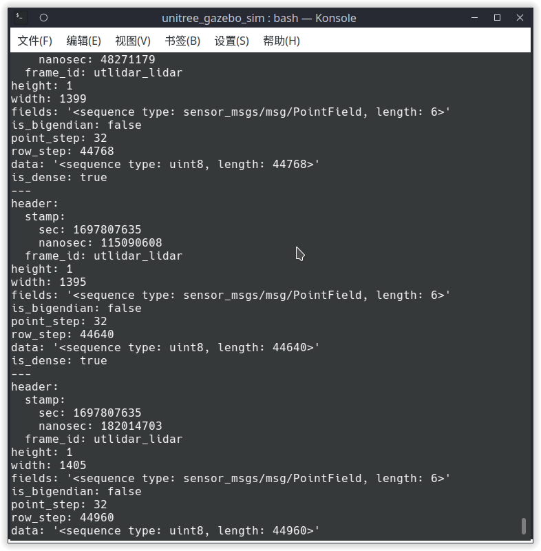
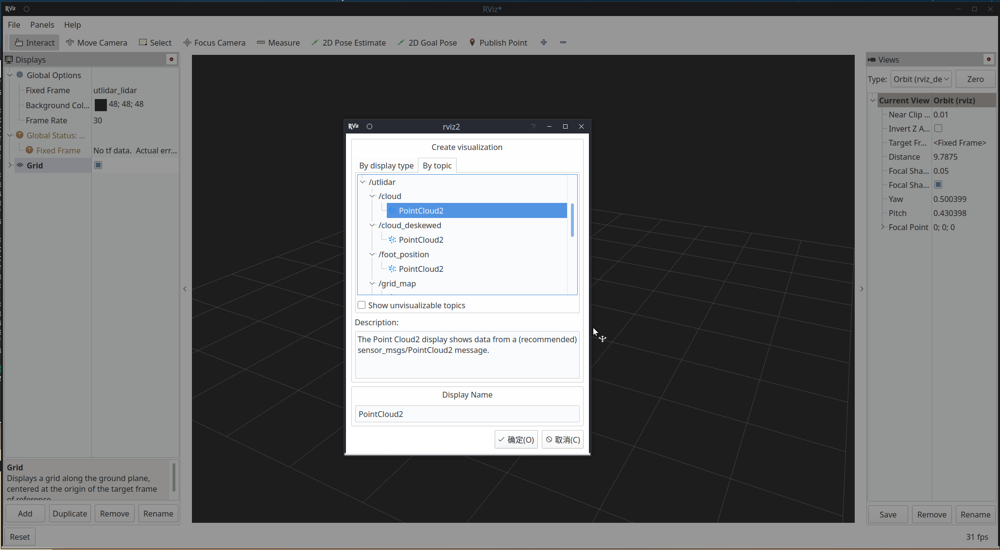
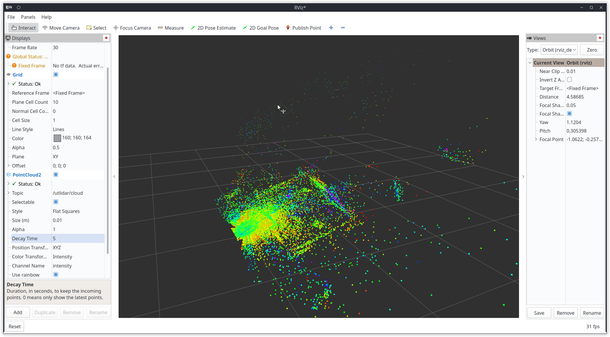

[TOC]
# Unitree 机器人ros2支持
Unitree SDK2基于cyclonedds实现了一个易用的机器人数据通信机制，应用开发者可以利用这一接口实现机器人的数据通讯和指令控制(**支持Go2、B2和H1**)。 https://github.com/unitreerobotics/unitree_sdk2
ROS2也使用DDS作为通讯工具，因此Go2、B2和H1机器人的底层可以兼容ros2，使用ros2自带的  msg 直接进行通讯和控制，而无需通过sdk接口转发。

# 环境配置
## 系统要求
测试过的系统和ros2版本
|系统|ros2 版本|
|--|--|
|Ubuntu 20.04|foxy|
|Ubuntu 22.04|humble (推荐)|

如果你想直接使用 `Docker` 开发环境，你可以参考 `.devcontainer` 文件夹中的 `Dockerfile` 相关内容。
你也可以使用 VSCode 或其他 IDE 的 Dev Container 功能来创建一个开发环境，或者使用 `Github` 的 `codespace` 快速创建一个开发环境。
如果你确实碰到了编译问题，可以参考 `.github/workflows/` 中的编译脚本，或者在 `issues` 中提问。

## 安装 Unitree 机器人ros2功能包

以下以ros2 foxy为例，如需要其他版本的ros2，在相应的地方替换foxy为当前的ros2版本名称即可：

ROS2 foxy的安装可参考: https://docs.ros.org/en/foxy/Installation/Ubuntu-Install-Debians.html

ctrl+alt+T打开终端，克隆仓库：https://github.com/unitreerobotics/unitree_ros2
```bash
git clone https://github.com/unitreerobotics/unitree_ros2
```
其中
- **cyclonedds_ws** 文件夹为编译和安装 Unitree 机器人ROS2 msg的工作空间，在子文件夹cyclonedds_ws/unitree/unitree_go和cyclonedds_ws/unitree/unitree_api中定义了机器人状态获取和控制相关的ros2 msg。
- **example** 文件夹为 Unitree 机器人 ROS2 下的相关例程。


## 安装 Unitree 机器人ros2功能包

### 1. 安装依赖

```bash
sudo apt install ros-foxy-rmw-cyclonedds-cpp
sudo apt install ros-foxy-rosidl-generator-dds-idl
```
### 2. 编译cyclone-dds(如果使用 Humble 可跳过此步骤)
由于 Unitree 机器人(sdk2 版本) 使用的是cyclonedds 0.10.2，因此需要先更改ROS2的dds实现。见：https://docs.ros.org/en/foxy/Concepts/About-Different-Middleware-Vendors.html

编译cyclonedds前请确保在启动终端时**没有**自动source ros2相关的环境变量，否则会导致cyclonedds编译报错。如果安装ROS2时在~/.bashrc中添加了 " source /opt/ros/foxy/setup.bash "，需要修改 ~/.bashrc 文件将其删除：

```bash
sudo apt install gedit
sudo gedit ~/.bashrc
``` 
在弹出的窗口中，注释掉ros2相关的环境变量，例如：
```bash
# source /opt/ros/foxy/setup.bash 
```
在终端中执行以下操作编译cyclone-dds
```bash
cd ~/unitree_ros2/cyclonedds_ws/src
#克隆cyclonedds仓库
git clone https://github.com/ros2/rmw_cyclonedds -b foxy
git clone https://github.com/eclipse-cyclonedds/cyclonedds -b releases/0.10.x 
cd ..
# 如果编译报错，尝试先运行：`export LD_LIBRARY_PATH=/opt/ros/foxy/lib`
colcon build --packages-select cyclonedds #编译cyclonedds
```


### 3. 编译unitree_go和unitree_api功能包
编译好 cyclone-dds 后就需要 ros2 相关的依赖来完成 Unitree 功能包的编译，因此编译前需要先 source ROS2 的环境变量。

```bash
source /opt/ros/foxy/setup.bash #source ROS2 环境变量
colcon build #编译工作空间下的所有功能包
```


## 连接到机器人

### 1. 配置网络 

使用网线连接 Unitree 机器人和计算机，使用 ifconfig 查看网络信息，确认机器人连接到的以太网网卡。（例如如图中的enp3s0，以实际为准）


接着打开网络设置，找到机器人所连接的网卡，进入 IPv4 ，将 IPv4 方式改为手动，地址设置为192.168.123.99，子网掩码设置为255.255.255.0，完成后点击应用，等待网络重新连接。


打开 setup.sh 文件

```bash
sudo gedit ~/unitree_ros2/setup.sh
```
bash 的内容如下：
```bash
#!/bin/bash
echo "Setup unitree ros2 environment"
source /opt/ros/foxy/setup.bash
source $HOME/unitree_ros2/cyclonedds_ws/install/setup.bash
export RMW_IMPLEMENTATION=rmw_cyclonedds_cpp
export CYCLONEDDS_URI='<CycloneDDS><Domain><General><Interfaces>
                            <NetworkInterface name="enp3s0" priority="default" multicast="default" />
                        </Interfaces></General></Domain></CycloneDDS>'
```
其中 "enp3s0" 为 Unitree 机器人所连接的网卡名称，根据实际情况修改为对应的网卡名称。在终端中执行：
```bash
source ~/unitree_ros2/setup.sh
```
即可完成 Unitree 机器人开发环境的设置。
如果不希望每次打开新终端都执行一次 bash 脚本，也可将 `setup.sh` 中的内容写入到 ~/.bashrc中，但是当系统有多个ros环境共存需要注意。

**补充：** 如果电脑没有连接到机器人，但仍希望能使用 unitree ros2 实现仿真等功能， 可以使用本地回环 "lo" 作为网卡
```bash
source ~/unitree_ros2/setup_local.sh # 使用 "lo" 作为网卡
```
或
```bash
source ~/unitree_ros2/setup_default.sh # 不指定网卡
```


### 2. 连接测试 
完成上述配置后，建议重启一下电脑再进行测试。
确保机器人连接正确，打开终端输入: 
```bash
source ~/unitree_ros2/setup.sh
ros2 topic list
```
可以看见如下话题：


打开终端输入ros2 topic echo /sportmodestate 后，可以看见该话题的数据如下图所示，说明机器人与电脑已经正常通讯：


### 3. 编译和测试例程

示例源代码位于 `/example/src/src`。
- common：所有机器人的通用函数。
- g1/low_level/g1_low_level_example：G1 的低级别控制
- h1-2/low_level/low_level_ctrl_hg：H1-2 的低电平控制
- low_level_ctrl：Go2/B2 的低级别控制
- read_low_state：读取 Go2/B2 的低级别状态
- read_low_state_hg：读取 G1/H1/H1-2 的低级别状态
- read_motion_state：读取 Go2/B2 的运动模式状态
- read_ wireless_controller：读取 G1/Go2/B2 的无线控制器状态
- record_bag：Ros Bag 录制示例。
- go2/go2_sport_client：Go2 的高级控制。
- go2/go2_stand_example：Go2 的站立示例。
- go2/go2_robot_state_client：的机器人状态示例。

ctrl+alt+T打开终端，在终端中执行如下命令，编译测试例程：
```bash
source ~/unitree_ros2/setup.sh
cd ~/unitree_ros2/example
colcon build
```
编译完成后在终端中运行:
```bash
./install/unitree_ros2_example/bin/read_motion_state 
```
可以看到终端中输出的机器人状态信息：
```bash
[INFO] [1697525196.266174885] [motion_state_suber]: Position -- x: 0.567083; y: 0.213920; z: 0.052338; body height: 0.320000
[INFO] [1697525196.266230044] [motion_state_suber]: Velocity -- vx: -0.008966; vy: -0.001431; vz: -0.019455; yaw: -0.002131
[INFO] [1697525196.266282725] [motion_state_suber]: Foot position and velcity relative to body -- num: 0; x: 0.204149; y: -0.145194; z: -0.067804, vx: 0.002683; vy: 0.003745; vz: -0.010052
[INFO] [1697525196.266339057] [motion_state_suber]: Foot position and velcity relative to body -- num: 1; x: 0.204200; y: 0.145049; z: -0.068205, vx: -0.001954; vy: -0.003442; vz: -0.004828
[INFO] [1697525196.266392028] [motion_state_suber]: Foot position and velcity relative to body -- num: 2; x: -0.183385; y: -0.159294; z: -0.039468, vx: -0.000739; vy: -0.002028; vz: -0.004532
[INFO] [1697525196.266442766] [motion_state_suber]: Foot position and velcity relative to body -- num: 3; x: -0.182412; y: 0.159754; z: -0.039045, vx: -0.002803; vy: -0.001381; vz: -0.004794
[INFO] [1697525196.316189064] [motion_state_suber]: Gait state -- gait type: 1; raise height: 0.090000
```

# 例程和使用
Go2机器人底层采用与ROS2兼容的dds通信方式，当安装和配置好Unitree Go2 ROS2环境后，可以通过订阅ROS2的topic实现机器人状态的获取和指令控制。
## 状态获取
### 1. 高层状态获取
高层状态为机器人的速度、位置、足端位置等与运动相关的状态。高层状态的获取可通过订阅"lf/sportmodestate"或"sportmodestate" topic 实现，其中"lf"表示低频率。高层状态的msg定义如下：
```C++
TimeSpec stamp //时间戳
uint32 error_code //错误代码
IMUState imu_state //IMU状态
uint8 mode //运动模式
/*
运动模式
0. idle, default stand
1. balanceStand
2. pose
3. locomotion
4. reserve
5. lieDown
6. jointLock
7. damping
8. recoveryStand
9. reserve
10. sit
11. frontFlip
12. frontJump
13. frontPounc
*/
float32 progress //是否动作执行状态：0. dance false; 1. dance true
uint8 gait_type //步态类型
/*
步态类型
0.idle  
1.trot  
2.run  
3.climb stair  
4.forwardDownStair   
9.adjust
*/
float32 foot_raise_height //抬腿高度
float32[3] position //当前位置
float32 body_height //机体高度
float32[3] velocity //线速度
float32 yaw_speed //偏行速度
float32[4] range_obstacle //障碍物范围 
int16[4] foot_force //足端力数值
float32[12] foot_position_body //足端相对于机体的位置
float32[12] foot_speed_body //足端相对于机体的速度
```
高层状态信息的具体解释可参考：https://support.unitree.com/home/zh/developer/sports_services

读取高层状态的完整例程位于 /example/src/read_motion_state.cpp
编译完例程后，在终端中运行./install/unitree_ros2_example/bin/read_motion_state，可查看运行结果。

### 2. 低层状态获取
低层状态为机器人的关节电机、电源信息等底层状态。通过订阅"lf/lowstate"或"lowstate" topic，可实现低层状态的获取。低层状态的msg定义如下：

```C++
uint8[2] head
uint8 level_flag
uint8 frame_reserve
uint32[2] sn
uint32[2] version
uint16 bandwidth
IMUState imu_state //IMU状态
MotorState[20] motor_state //电机状态
BmsState bms_state
int16[4] foot_force //足端力数值
int16[4] foot_force_est //估计的足端力
uint32 tick
uint8[40] wireless_remote
uint8 bit_flag
float32 adc_reel
int8 temperature_ntc1
int8 temperature_ntc2
float32 power_v //电池电压
float32 power_a //电池电流
uint16[4] fan_frequency 
uint32 reserve
uint32 crc
```
其中MotorState为关节电机的状态信息，其定义如下：
```C++
uint8 mode //运动模式
float32 q //当前角度
float32 dq //当前角速度
float32 ddq //当前角加速度
float32 tau_est //估计的外力
float32 q_raw //当前角度原始数值
float32 dq_raw //当前角速度原始数值
float32 ddq_raw //当前角加速度原始数值
int8 temperature //温度
uint32 lost
uint32[2] reserve
```
低层状态信息的具体解释可参考: https://support.unitree.com/home/zh/developer/Basic_services
读取低层状态的完整例程序位于：example/src/read_low_state.cpp
在终端中运行./install/unitree_ros2_example/bin/read_low_state，可查看低层状态获取例程的运行结果。

### 3. 遥控器状态获取
通过订阅"/wirelesscontroller" topic可获取遥控器的摇杆数值和按键键值。遥控器状态的msg定义如下

```C++
float32 lx //左边摇杆x
float32 ly //左边摇杆y
float32 rx //右边摇杆x
float32 ry //右边摇杆y
uint16 keys //键值
```
遥控器状态和遥控器键值的相关定义可参考：https://support.unitree.com/home/zh/developer/Get_remote_control_status

读取遥控器状态的完整例程序见：example/src/read_wireless_controller.cpp
在终端中运行./install/unitree_ros2_example/bin/read_low_state，可查看遥控器状态获取例程的运行结果。

## 机器人控制
### 1. 运动控制
Go2机器人的运动指令是通过请求响应的方式实现的，通过订阅"/api/sport/request"，并发送运动unitree_api::msg::Request消息可以实现高层的运动控制。其中不同运动接口的Request消息可调用SportClient(位于/example/src/common/ros2_sport_client.cpp)类来获取，例如实现Go2的姿态控制：
```C++
 //创建一个ros2 pubilsher
rclcpp::Publisher<unitree_api::msg::Request>::SharedPtr req_puber = this->create_publisher<unitree_api::msg::Request>("/api/sport/request", 10);

SportClient sport_req;//实例化一个sportclient
unitree_api::msg::Request req; //创建一个运动请求msg
sport_req.Euler(req,roll,pitch,yaw); //获取欧拉角运动请求消息，并赋值给req

req_puber->publish(req); //发布数据
```
关于SportClient运动控制接口的具体解释可参考：https://support.unitree.com/home/zh/developer/sports_services

高层运动控制的完整例程位于：example/src/sport_mode_ctrl.cpp
在终端中运行./install/unitree_ros2_example/bin/sport_mode_ctrl，等待1s后，机器人会沿着x方向来回走动。


### 2. 电机控制
通过订阅"/lowcmd" topic，并发送unitree_go::msg::LowCmd可以实现对电机的力矩、位置、和速度控制。底层控制指令的msg定义如下:

```C++
uint8[2] head
uint8 level_flag
uint8 frame_reserve
uint32[2] sn
uint32[2] version
uint16 bandwidth
MotorCmd[20] motor_cmd //电机指令
BmsCmd bms_cmd
uint8[40] wireless_remote
uint8[12] led
uint8[2] fan
uint8 gpio
uint32 reserve
uint32 crc
```
其中motor_cmd为电机指令:
```C++
uint8 mode;  //电机控制模式（Foc模式（工作模式）-> 0x01 ，stop模式（待机模式）-> 0x00
float q;     //关节目标位置
float dq;    //关节目标速度
float tau;   //关节目标力矩
float kp;    //关节刚度系数
float kd;    //关节阻尼系数
unsigned long reserve[3];   //保留位
```
低层指令的具体解释可参考：https://support.unitree.com/home/zh/developer/Basic_services

电机控制的完整例程见example/src/low_level_ctrl.cpp，编译后在终端执行./install/unitree_ros2_example/bin/sport_mode_ctrl，左后腿的机身电机和小腿电机会转动到对应关节角度。

## Rviz 可视化
由于Go2机器人底层兼容了ROS2的topic机制，因此可以使用rviz工具来可视化Go2机器人的状态信息。下面以查看机器人的点云数据为例：
首先列出所有 topic：
```bash
ros2 topic list
```


可以找到雷达点云的 topic：
```bash
utlidar/cloud
```
接着查看点云的frame_id：
```
ros2 topic echo --no-arr /utlidar/cloud
```
可以看到点云数据的frame_id为utlidar_lidar


最后打开rviz2：
```
ros2 run rviz2 rviz2
```
在rviz2添加Go2点云topic: utlidar/cloud。修改world_frame为utlidar_lidar即可看到雷达输出的点云。





